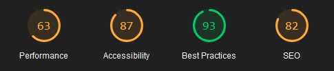

# 🌐 Website Project (WIP)

---

## 🚀 Demo  
[View the live demo here!](https://adrianolmrs.github.io/Website/app/public/)  

---

## 🔧 Features  
- **Interactive User Interface:** A clean and responsive design.  
- **Performance Optimizations:** Focused on achieving high scores on Lighthouse tests.  

---

## 🛠️ Improvements To-Do  

### 📈 Enhance Performance Metrics  
Working to improve the website's **Lighthouse results**:   
  

### 🎯 Upcoming Tasks  
- Optimize assets and reduce page load time.  
- Improve accessibility and best practices score.  
- Add more content and interactive features.  

---

## 🤝 Contributing  
Feel free to fork the project, submit pull requests, or suggest ideas through the issues tab. Contributions are welcome!  

--- 

Let me know if you’d like help expanding this further!